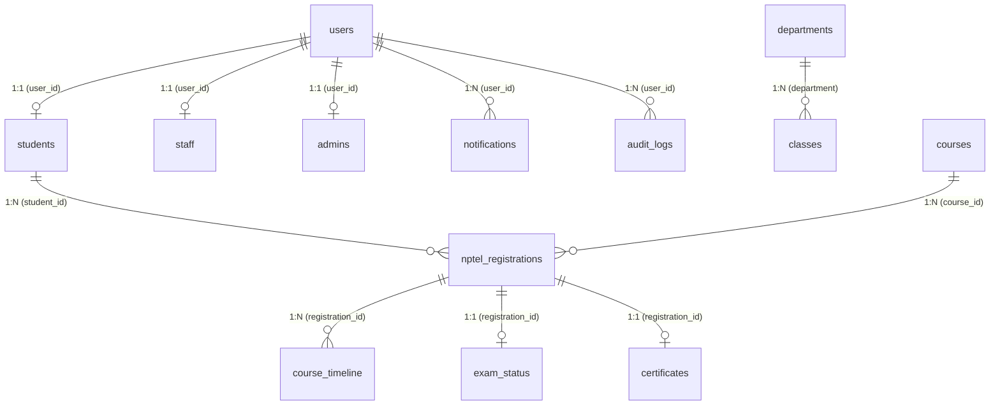

# NPTEL Management System — Architecture Specification

This document defines the architectural foundation, project separation, database schema, security boundaries, and communication flow established in **Phase 1, Step 2**.

---

## 1. Solution Structure & Project Responsibilities

The solution `NPTELManagement.sln` is organized into a clean 4-tier modular architecture targeting **.NET 8.0**:

```
NPTELManagement.sln
├── Core (NPTELManagement.Core)
│   ├── Entities/       -> Domain entities (User, Student, Staff, Admin, etc.)
│   ├── Enums/          -> Domain enumerations (UserRole, RegistrationStatus, etc.)
│   ├── DTOs/           -> Transfer objects (LoginRequest, Profile responses, etc.)
│   ├── Interfaces/     -> Repository and service contracts
│   └── Common/         -> Result envelopes (ApiResponse<T>)
│
├── Infrastructure (NPTELManagement.Infrastructure)
│   ├── Data/           -> ApplicationDbContext, EF Core mappings, and Migrations
│   ├── Repositories/   -> Concrete database repository implementations
│   ├── Authentication/ -> BCrypt password hashing, JWT token services
│   ├── Storage/        -> Supabase private storage integration client
│   └── Configuration/  -> Database options, connection string helpers
│
├── Api (NPTELManagement.Api)
│   ├── Controllers/    -> REST API endpoints (Auth, Student, Staff, Admin, Health)
│   ├── Middleware/     -> Global exception handling, request logging
│   ├── Authorization/  -> Role-based policies and permission handlers
│   └── Configuration/  -> Service registration, CORS, JWT authentication setup
│
├── Desktop (NPTELManagement.Desktop)
│   ├── Views/          -> WPF XAML windows and pages (Splash, Login, Dashboards)
│   ├── ViewModels/     -> MVVM ViewModels managing UI state and commands
│   ├── Services/       -> Strongly-typed HTTP ApiClient communicating with API
│   ├── Models/         -> Desktop-specific UI models and observable bindings
│   ├── Resources/      -> Icons, fonts, and static resources
│   └── Styles/         -> Academic navy theme, control templates, card styles
│
├── Database/
│   ├── 01_init_schema.sql           -> Production PostgreSQL DDL (13 tables, keys, triggers)
│   └── 02_seed_initial_accounts.sql -> Initial development accounts with hash placeholders
│
└── Documentation/
    └── architecture.md              -> This document
```

---

## 2. Dependency Hierarchy & Architectural Rules

```
WPF Desktop Client (Desktop)
        │
        ▼ (HTTP / HTTPS REST + JWT Bearer)
ASP.NET Core Web API (Api)
   ├──▶ Core
   └──▶ Infrastructure
              │
              ▼
            Core
```

### Critical Architectural Isolation:
1. **Desktop Project Isolation**: The WPF client **only** references `NPTELManagement.Core` for DTOs and contracts. It **never** references `NPTELManagement.Infrastructure`.
2. **Zero Backend Secrets on Client**: The WPF client does not contain PostgreSQL connection strings, database passwords, JWT signing keys, or cloud storage service keys.
3. **Database Isolation**: The database is accessed exclusively by `NPTELManagement.Infrastructure` via Npgsql / EF Core from within the ASP.NET Core API process.

---

## 3. Database Schema & Relationships

The database is built on **PostgreSQL (Supabase)** using UUID primary keys, explicit foreign keys, check constraints, indexes, and automated `updated_at` triggers.

### Core Tables & Relationships



### Table Summary (13 Production Tables)
1. **`users`**: Authentication credentials (`id`, `username`, `password_hash`, `role`, `email`, `is_active`, `created_at`, `updated_at`). Constraint: `role IN ('Student', 'Staff', 'Admin')`.
2. **`students`**: Student academic records (`student_id`, `user_id`, `name`, `register_number`, `department`, `class_section`, `year`, `batch`, `email`, `phone`). Constraint: `year BETWEEN 1 AND 4`.
3. **`staff`**: Faculty records with class responsibilities (`staff_id`, `user_id`, `staff_name`, `staff_identifier`, `department`, `assigned_year`, `assigned_class`). Constraint: `assigned_year BETWEEN 1 AND 4`.
4. **`admins`**: Administrator registry (`admin_id`, `user_id`, `admin_identifier`).
5. **`departments`**: Academic departments (`department_id`, `code`, `name`). Initially CSE.
6. **`classes`**: Department sections (`class_id`, `department`, `year`, `section`). Unique across `(department, year, section)`.
7. **`courses`**: NPTEL courses (`course_id`, `course_code`, `course_name`, `duration_weeks`). Constraint: `duration_weeks > 0`.
8. **`nptel_registrations`**: Student course enrollments (`registration_id`, `student_id`, `course_id`, `enrollment_date`, `status`). Unique across `(student_id, course_id)`.
9. **`course_timeline`**: Weekly assignment tracking (`timeline_id`, `registration_id`, `week_number`, `status`). Constraint: `week_number > 0`.
10. **`exam_status`**: Examination tracking (`exam_status_id`, `registration_id`, `exam_date`, `hall_ticket_status`, `score`, `pass_status`). Constraint: `score BETWEEN 0 AND 100`.
11. **`certificates`**: Certificate metadata (`certificate_id`, `registration_id`, `storage_path`, `issued_date`, `verified_status`). Binary PDFs are **never** stored in PostgreSQL.
12. **`notifications`**: User alert messages (`notification_id`, `user_id`, `title`, `message`, `is_read`).
13. **`audit_logs`**: Append-only security audit events (`log_id`, `user_id`, `action`, `details`, `ip_address`, `timestamp`).

---

## 4. Authentication & Security Boundaries

### Password Security:
- Plaintext passwords are **strictly forbidden** at every layer.
- Backend uses **BCrypt / ASP.NET Identity PasswordHasher** with salt and cost factor.
- Database SQL scripts (`02_seed_initial_accounts.sql`) use placeholders and never store plaintext passwords.

### Token Session:
- Authentication is token-based using **cryptographic JWT** (JSON Web Tokens).
- Claims include: `sub` (User ID), `role` (Student / Staff / Admin), `unique_name` (Username/Identifier).
- Role-based authorization policies are enforced on the API controllers.

### Permission Enforcements (API Level):
- **Admin**: Full administrative visibility across students, staff, and system statistics.
- **Staff**: Scoped strictly to assigned department, year, and class (`GET /api/v1/staff/students`). Out-of-scope requests return `403 Forbidden`.
- **Student**: Scoped exclusively to own profile (`GET /api/v1/student/me`). Cross-student queries are prevented by reading identity from verified JWT claims.

---

## 5. Cloud Storage Direction (Certificates)

- Cloud storage is hosted via **Supabase Storage**.
- Buckets are **private** (non-public).
- Structure pattern: `certificates/student/{studentId}/{registrationId}.pdf`.
- Access pattern: The API generates authenticated time-limited signed URLs upon verification; no permanent public URLs are exposed.
